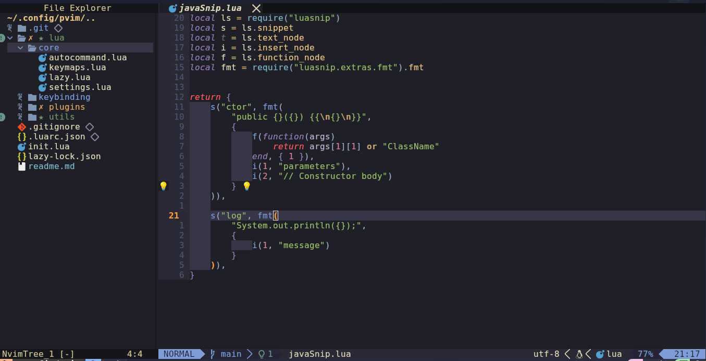

# pvim Setup Guide

## Prerequisites

- **Neovim version 0.9.0 or above** must be installed on your system. To check your Neovim version, run:

  ```bash
  nvim --version
  ```

*** Still a WIP(work in progress) ***



# Setup Instructions

##### -> NB. Follow this way to not affect your actual nvim config

#### 1. Clone the pvim repository

Clone the pvim repository into the ~/.config directory by running the following command:

```
git clone https://github.com/elitekaycy/pvim.git ~/.config/pvim
```

Replace <repository_url> with the actual URL of the pvim repository.

#### 2. Edit your .zshrc or .bashrc

Open your ~/.zshrc (or ~/.bashrc if you're using Bash) and add the following alias:

```
export JAVA_HOME=$(asdf where java) or java home path
alias pvim='NVIM_APPNAME=pvim nvim'
```

This alias creates a shortcut for running Neovim with your custom configuration.

#### 3. Reload the shell configuration

To apply the changes, reload your shell configuration:

```
source ~/.zshrc # For Zsh users
source ~/.bashrc # For Bash users 4. Use pvim

```

Now you can use the pvim command to open Neovim with your custom configuration.
