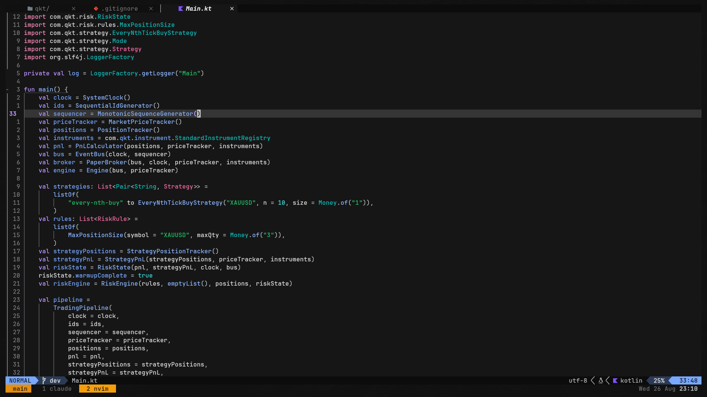

# pvim

[](./LICENSE)
[](https://neovim.io)

### A personalized Neovim configuration built for a streamlined, efficient workflow — with first-class Java/Spring Boot support.

[Install](#install) · [Keybindings](./docs/keybindings.md) · [Java](./docs/java.md) · [Plugins](./docs/plugins.md) · [AI Suggestions](./docs/ai-suggestions.md)



* * *

```bash
git clone https://github.com/elitekaycy/pvim.git ~/.config/pvim && ~/.config/pvim/install.sh
```

## Why pvim

- **One editor, full-stack Java + web.** JDTLS-backed Java/Spring Boot support — module generation, JUnit runner, extract/inline refactors — alongside TypeScript, Angular, JSP and FreeMarker, all through one consistent keymap.
- **Everything reachable without leaving insert mode's neighborhood.** Telescope for files/grep/buffers, Harpoon for instant jumps, Flash for 2-3 keystroke motion, a searchable key reference (`:PvimSource`) baked in.
- **Git without leaving the editor.** Neogit for a full Magit-style interface, Diffview for side-by-side diffs and history, gitsigns and lazygit wired into the same keymap.
- **APIs and databases inline.** `.http` files with a full REST client and snippet library; `vim-dadbod` for MySQL/Postgres/SQLite queries — no Postman, no separate DB client.
- **Optional AI, opt-in and cheap.** Copilot-style ghost text via Claude Haiku, off by default, with a 3-tier cache designed to minimize token spend.
- **A real PATH binary, not a shell alias.** `pvim` launches with `NVIM_APPNAME=pvim`, so it coexists cleanly with a stock Neovim config.

## Install

```bash
git clone https://github.com/elitekaycy/pvim.git ~/.config/pvim && ~/.config/pvim/install.sh
```

This installs Neovim 0.11+, Node.js 18+ and Java 17+ if missing, the CLI tools it depends on (ripgrep, fd, fzf, lazygit), shell aliases, and syncs plugins + LSP servers.

For manual setup, the launcher contract, and broot integration, see **[docs/install.md](./docs/install.md)**.

Once inside pvim, run `:PvimSource` for a live, filterable version of the full keybinding reference.

## Supported Languages

| Language | LSP | Debugging | Snippets |
|----------|-----|-----------|----------|
| Java/Spring Boot | JDTLS | nvim-dap | Extensive |
| TypeScript/JavaScript | ts_ls | - | friendly-snippets |
| HTML/CSS | html-lsp, css-lsp | - | friendly-snippets |
| Tailwind CSS | tailwindcss | - | - |
| C/C++ | clangd | codelldb | friendly-snippets |
| Lua | lua_ls | - | friendly-snippets |
| Angular | angularls | - | - |
| JSP | html-lsp | - | Custom JSTL/EL |
| FreeMarker (FTL) | html-lsp | - | Custom |

## Documentation

- **[docs/keybindings.md](./docs/keybindings.md)** — the full keybinding reference (also live in-editor via `:PvimSource`)
- **[docs/java.md](./docs/java.md)** — Java/Spring Boot: JDTLS, module generator, snippets, JSP/FreeMarker
- **[docs/http-sql.md](./docs/http-sql.md)** — REST client and database client, plus HTTP/SQL snippet libraries
- **[docs/plugins.md](./docs/plugins.md)** — per-plugin reference: git tools, testing, search/replace, diagnostics, sessions, and more
- **[docs/ai-suggestions.md](./docs/ai-suggestions.md)** — Claude-powered ghost text completions
- **[docs/install.md](./docs/install.md)** — manual install, the launcher contract, broot integration, uninstall

## Project Structure

```
~/.config/pvim/
├── init.lua              # Entry point
├── lua/
│   ├── core/             # Core settings
│   ├── keybinding/       # Key mappings
│   ├── plugins/          # Plugin configurations
│   │   ├── default/      # Core plugins
│   │   ├── extras/       # Optional plugins
│   │   └── lsp/          # Language servers
│   └── util/             # Utilities
├── snippets/             # LuaSnip snippets
│   └── luasnippets/
│       ├── java.lua      # Java/Spring Boot
│       ├── jsp.lua       # JSTL/JSP
│       ├── ftl.lua       # FreeMarker
│       ├── http.lua      # REST API testing
│       └── sql.lua       # SQL/Database
└── syntax/               # Custom syntax files
    ├── jsp.vim
    └── ftl.vim
```

## Troubleshooting

See **[docs/troubleshooting.md](./docs/troubleshooting.md)** for plugin, LSP, Java, and launcher issues.

## Uninstall

```bash
rm -rf ~/.config/pvim ~/.local/share/pvim ~/.local/state/pvim ~/.cache/pvim
```

Remove the `pvim` alias from your shell config.

## License

[MIT](./LICENSE)
